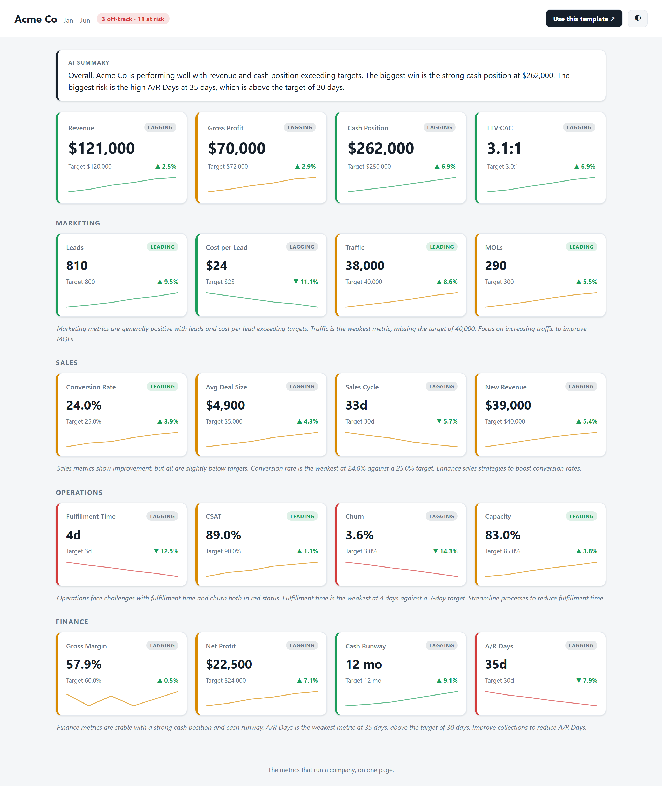

# CEO Dashboard

A dead-simple, open-source dashboard for the handful of numbers that actually run a
company. One page. No build step. No dependencies. No server.

Clone it, edit one file, open it in your browser.

**Live demo:** https://ceo.neonskyai.com



## What it tracks

The metrics that run a company, grouped into pillars with **leading** and
**lagging** indicators. Each card shows the current value, your target, a
status color (are you on track?), and a trend sparkline over time.

- **Headline vitals** — Revenue, Gross Profit, Cash Position, LTV:CAC
- **Marketing** — Leads, Cost per Lead, Traffic, MQLs
- **Sales** — Conversion Rate, Avg Deal Size, Sales Cycle, New Revenue
- **Operations** — Fulfillment Time, CSAT, Churn, Capacity
- **Finance** — Revenue, Gross Margin, Net Profit, Cash Runway

## Quick start

1. Download or clone this repo.
2. Open `data.js` and replace the numbers with your own.
3. Double-click `index.html`. Done.

No install, no `npm`, no server. It runs straight off your file system.

## Editing your numbers

Everything lives in `data.js`. It sets one global object:

```js
window.DASHBOARD_DATA = {
  company: "Acme Co",
  period: { labels: ["Jan", "Feb", "Mar", "Apr", "May", "Jun"] },
  headline: ["revenue", "grossProfit", "cash", "ltvCac"],
  metrics: [ /* ... */ ]
};
```

Each metric looks like this:

```js
{
  id: "revenue",        // unique key; referenced by `headline`
  label: "Revenue",     // shown on the card
  pillar: "Finance",    // Headline | Marketing | Sales | Operations | Finance
  type: "lagging",      // leading | lagging
  unit: "currency",     // currency | percent | number | days | ratio
  target: 120000,       // your goal
  direction: "up",      // up = higher is better, down = lower is better
  values: [90000, 96000, 104000, 110000, 118000, 121000] // one per period label
}
```

### Field reference

| Field       | Meaning                                                                 |
|-------------|-------------------------------------------------------------------------|
| `id`        | Unique key. List an id in `headline` to feature it in the top row.      |
| `label`     | Display name on the card.                                               |
| `pillar`    | Which section it appears in. `Headline` = top-row only.                 |
| `type`      | `leading` (predictive) or `lagging` (result). Shown as a tag.          |
| `unit`      | `currency`, `percent`, `number`, `days`, or `ratio`. Controls format.  |
| `target`    | Your goal. Drives the status color.                                     |
| `direction` | `up` = higher is better; `down` = lower is better (e.g. churn, CAC).    |
| `values`    | Time series, one value per `period.labels` entry, oldest → newest.      |

**Status colors:** green = at/beyond target, amber = within 10% on the wrong
side, red = further off. **Trend:** compares the latest value to the prior one.

`values[]` length must match `period.labels` length.

## More examples

See `examples/` for alternate datasets (e.g. an early SaaS startup). To use one,
copy its contents into `data.js`.

## AI insights (optional)

The dashboard can show plain-language AI commentary: an executive summary at the
top and a one-line story under each pillar row. These are **pre-generated** and
baked into a static `insights.js` — no API key is ever needed in the browser, and
the dashboard still works with `insights.js` absent.

Generate or refresh them (needs [Node](https://nodejs.org) + an OpenAI key):

```bash
export OPENAI_API_KEY=sk-...        # or put it in a .env file next to data.js
node tools/generate-insights.mjs    # reads data.js, writes insights.js
```

- Model: set `INSIGHTS_MODEL` (default `gpt-4o`).
- Preview without writing: `node tools/generate-insights.mjs --dry-run`.
- **Rerun after editing `data.js`.** If the numbers change, the dashboard shows a
  small "insights may be outdated — regenerate" note until you do.

Don't want AI text? Delete `insights.js` (or never generate it) and the dashboard
renders cleanly without it.

## Theme

Toggle light/dark with the button in the top-right. Your choice is remembered.

## Development

Pure vanilla HTML/CSS/JS. The formatting/status/trend/sparkline logic lives in
`app.js` as pure functions, unit-tested with Node's built-in `assert`:

```bash
node tests/helpers.test.js
```

## License

MIT — see [LICENSE](LICENSE).
